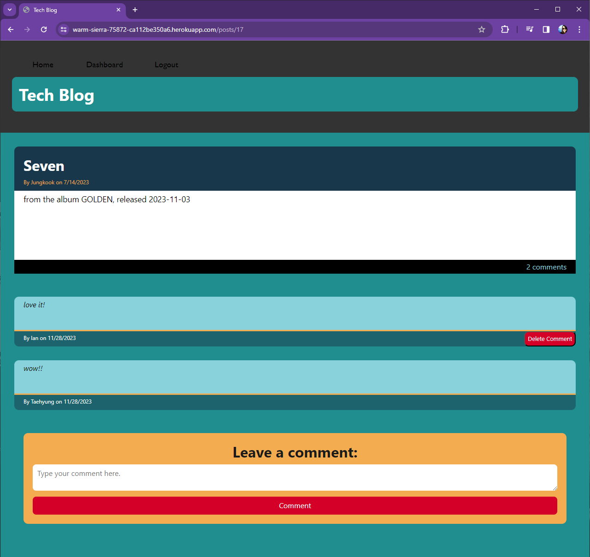

# 14-MVC-CMS-Style-Personal-Tech-Blog
 

## Description
This application is a CMS-style blog site similar to a Wordpress site, where developers can spend some of their time reading and writing about technical concepts, recent advancements, and new technologies. They can publish blog posts and comment on other developers’ posts as well.  

## Table of Contents
- [Deployed Application and GitHub Repository](#deployed-application-and-github-repository)
- [Usage](#usage)
- [License](#license)
- [Resources](#resources)

## Deployed Application and GitHub Repository
[Tech Blog](https://warm-sierra-75872-ca112be350a6.herokuapp.com/)  
[GitHub Repository](https://github.com/hjlee17/14-mvc-cms-style-personal-tech-blog.git)

## Usage
All posts are viewable even if a user is not logged in, but for full functionality, users must sign up and be logged in.  
Logged in users will be able to create/edit/delete posts and view/add/delete comments.

_The email user1@test.com with the password 'qwerty' will log a user in as the test user "Ian Lin" (generated by the seed data)._

### Login and Signup
- When navigating to the site, users will have a choice to login or sign up.  

### Dashboard
- Once logged in, users will be directed to their dashboard where they can view all of their posts (including an option to update or delete them) and create a new post.  
- Also, the login button will be replaced by a logout button in the navigation bar.    

### Homepage
- On the homepage, all posts are listed, starting with the most recent.
- The option to update or delete a user's own post will be available if they authored the post.
- Clicking on the title of the post will lead to a view of that individual post.  
  

### Single Post View & Commenting
- Clicking on the title of the post will direct the user to a view of that individual post.  
- Here, users can leave comments and view all other comments on this tile. 
- If it is a user's own tile, the update and delete buttons will still be visible, but otherwise there will be no update/delete tile buttons available. 
- There will be an option to delete comments if the logged in user is either the author of the post or the author of the comment.

### Deleting or Uptdaing a Post
- When a user tries to update their post, they are able to edit the title and/or post content and update the post.
- When a user tries to delete their post, they are taken to a second page to confirm deletion.  
- In case the user does not want to delete their post, they can navigate away from this page.  
- When the user updates or deletes their post, they are directed back to their dashboard.  

## Technologies Used
This Node Express application uses the following packages:
  - [bcrypt v.5.1.1](https://www.npmjs.com/package/bcrypt/v/5.1.1)
  - [colors v.1.4.0](https://www.npmjs.com/package/colors/v/1.4.0)
  - [connect-session-sequelize v.7.1.7](https://www.npmjs.com/package/connect-session-sequelize/v/7.1.7)
  - [dotenv v.16.3.1](https://www.npmjs.com/package/dotenv/v/16.3.1)
  - [express v.4.18.2](https://www.npmjs.com/package/express/v/4.18.2)
  - [express-handlebars v.7.1.2](https://www.npmjs.com/package/express-handlebars/v/7.1.2)
  - [express-session v.1.17.3](https://www.npmjs.com/package/express-session/v/1.17.3)
  - [mysql2 v.3.6.3](https://www.npmjs.com/package/mysql2/v/3.6.3)
  - [sequelize v.6.35.0](https://www.npmjs.com/package/sequelize/v/6.35.0)
  
The `colors` package was used to modify console.logs for development.  
The application uses `dotenv` for environment variable management.  
The `Sequelize` package is used to store the database.  
The `bcrypt` package handles hashing passwords stored in the User model.  
The application utilizes `connect-session-sequelize` and `express-sessions` to store sessions to the database.  
`Express-handlebars` is the view engine for rendering handlebars templates.  

## License
[The MIT License](https://opensource.org/licenses/MIT/)

## Resources
- [MDN Web Docs](developer.mozilla.org)  
- [W3Schools](www.w3schools.com/)  
- [stack overflow](stackoverflow.com/)  
- [Sequelize v6 Documentation](https://sequelize.org/docs/v6/)  
- [Blog Post about using { plain:true } to serialize Sequelize data](https://www.michaellapan.com/posts/sequelize-plain-true)  
- [Flexbox CSS Guide](https://css-tricks.com/snippets/css/a-guide-to-flexbox/)  

## Questions
- GitHub: [hjlee17](https://github.com/hjlee17)
